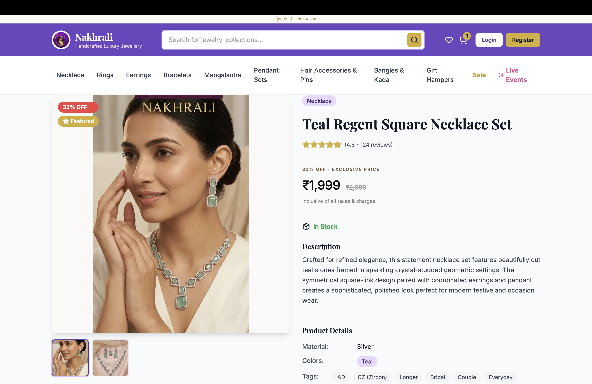
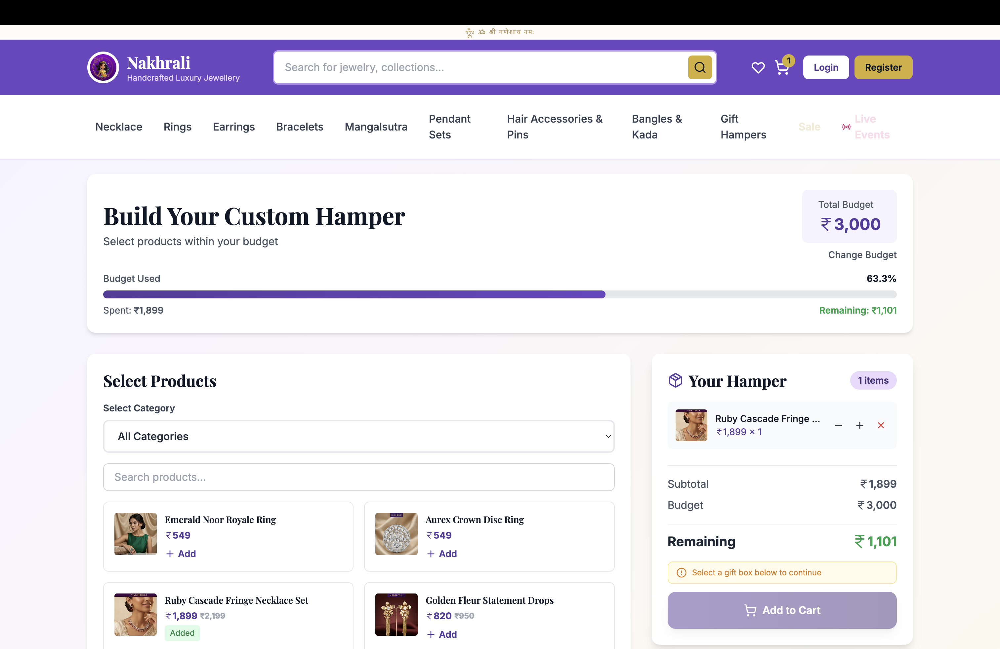
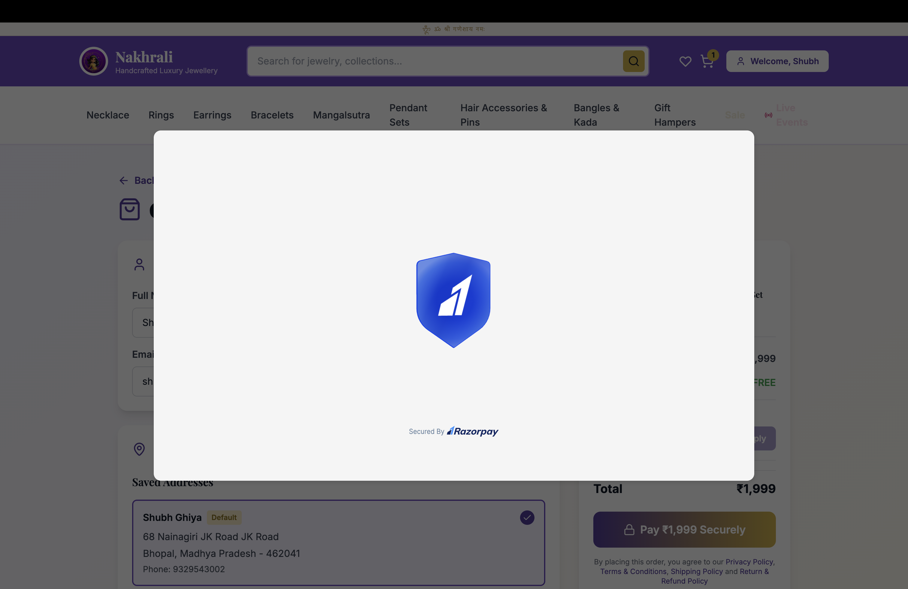
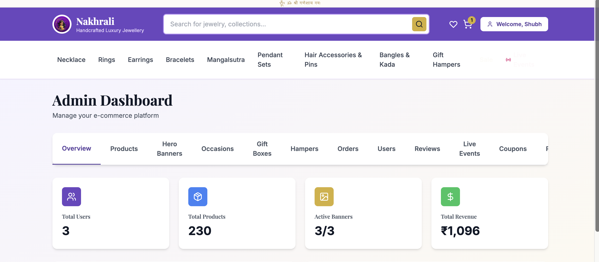
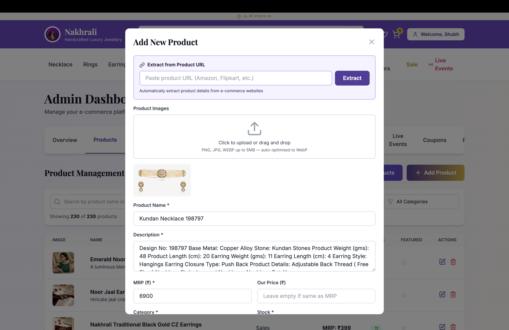
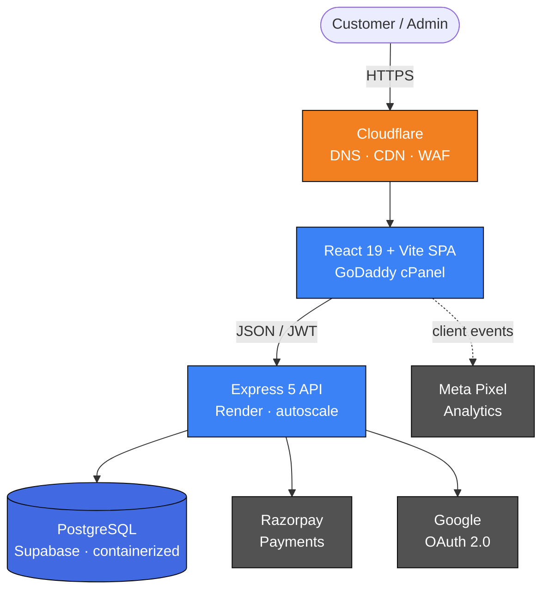

<div align="center">


# Nakhrali Luxury

### A production e-commerce platform powering a Pune-born D2C fashion jewellery brand.

**Designed, built, deployed, and maintained — solo. Live in production, serving customers across India.**

<br />

<a href="https://nakhraliluxury.com">
  
</a>
&nbsp;
<a href="mailto:ghiyashubh23@gmail.com?subject=Nakhrali%20code%20walkthrough">
  
</a>

<br /><br />


</div>

---

<div align="center">


<sub><i>The live storefront at nakhraliluxury.com</i></sub>

</div>

---

<div align="center">

### The client manages products, banners, hampers, and orders independently — without developer involvement.

<sub>Built so a non-technical operator runs the business day-to-day. The engineer is not in the loop for merchandising.</sub>

</div>

---

## At a glance

<table align="center">
  <tr>
    <td align="center" width="20%"><b>~2&nbsp;months</b><br /><sub>concept&nbsp;→ production</sub></td>
    <td align="center" width="20%"><b>14,000+</b><br /><sub>lines of code</sub></td>
    <td align="center" width="20%"><b>0</b><br /><sub>critical security issues at launch</sub></td>
    <td align="center" width="20%"><b>&lt; 50&nbsp;ms</b><br /><sub>search-as-you-type latency</sub></td>
    <td align="center" width="20%"><b>100%</b><br /><sub>client-managed merchandising</sub></td>
  </tr>
</table>

---

## About this repository

This repository is a **public case study, not the source code.** The application is a paid client engagement and lives in a private repository under a confidentiality agreement.

> Hiring teams and recruiters can request read access to the private repo by email. I'm happy to walk through the codebase on a call.

---

## What it is

A full-stack e-commerce platform — storefront, custom hamper builder, admin dashboard, payments, and analytics — built end-to-end for [Nakhrali](https://nakhraliluxury.com). Unlike a demo storefront, this system supports real orders, payments, admin operations, and ongoing client use — operated day-to-day by a non-technical client.

|  |  |
| :--- | :--- |
| **Stack** | React 19 · Vite · Tailwind · Express 5 · PostgreSQL · JWT · Google OAuth |
| **Hosting** | GoDaddy (frontend) · Render (backend) · Supabase (database) · Cloudflare (CDN + WAF) |
| **Scale** | ~14,000 LOC · 14 frontend routes · 9 backend resources · 9 DB migrations |
| **Status** | Live, actively maintained, on retainer for new features |

---

## What sets it apart

<table>
  <tr>
    <td width="33%" valign="top">
      <h3>Custom hamper builder</h3>
      Interactive gift-box configurator with drag-and-drop SKU selection, live pricing, and stock validation. Not a feature you'll find in starter projects.
    </td>
    <td width="33%" valign="top">
      <h3>One-click product import</h3>
      Admin pastes an Amazon or Flipkart URL — the backend scrapes title, description, price, and all gallery images. SKU onboarding dropped from <b>~10 minutes</b> to <b>~10 seconds</b>.
    </td>
    <td width="33%" valign="top">
      <h3>Self-serve admin</h3>
      The client manages all merchandising — products, banners, hampers, occasions, orders — without ever touching code or pinging the engineer.
    </td>
  </tr>
  <tr>
    <td width="33%" valign="top">
      <h3>Razorpay live payments</h3>
      UPI, cards, netbanking, wallets, and COD, with server-side HMAC-SHA256 signature verification so the frontend can never lie about payment success.
    </td>
    <td width="33%" valign="top">
      <h3>Production-grade security</h3>
      Helmet, rate limiting, XSS sanitization, parameterized queries everywhere, bcrypt at 12 rounds, OWASP Top 10 hardened.
    </td>
    <td width="33%" valign="top">
      <h3>Sub-second LCP on mobile</h3>
      Cloudflare edge caching, image optimization, code splitting, and preconnect hints. Cold-cache loads ~200ms faster than baseline.
    </td>
  </tr>
</table>

---

## Screenshots

> Captured live from production at [nakhraliluxury.com](https://nakhraliluxury.com).

<table>
  <tr>
    <td width="50%" align="center">
      
      <br /><sub><b>Product detail</b> — multi-image gallery, persistent cart, live stock</sub>
    </td>
    <td width="50%" align="center">
      
      <br /><sub><b>Hamper builder</b> — drag-and-drop SKUs, live pricing</sub>
    </td>
  </tr>
  <tr>
    <td width="50%" align="center">
      
      <br /><sub><b>Checkout</b> — Razorpay (UPI · cards · netbanking · wallets) plus COD</sub>
    </td>
    <td width="50%" align="center">
      
      <br /><sub><b>Admin dashboard</b> — revenue, users, orders, top products</sub>
    </td>
  </tr>
  <tr>
    <td colspan="2" align="center">
      
      <br /><sub><b>One-click scraper</b> — paste Amazon/Flipkart URL, the backend extracts title, description, price, and gallery</sub>
    </td>
  </tr>
</table>

---

## Architecture



The frontend is a static React build served from GoDaddy and accelerated by Cloudflare. The Express API runs on Render and is the only client of the database. The database itself is never publicly addressable — it lives in a Supabase-managed container reachable only via the API's connection string. Razorpay and Google OAuth are server-to-server integrations; secrets never touch the browser.

---

## Tech decisions

The interesting part of any project is what was rejected, not just what was chosen.

**Express 5 over Next.js.** Next.js is the default reach for "I need a website with a backend," but the brand needed clear separation: a marketing-friendly static frontend the client could move between hosts if needed, and an API I could scale or replace independently. A monolithic SSR framework would have coupled the two and made a GoDaddy-plus-Render hosting story impossible. The trade-off — losing built-in SSR — was acceptable because the storefront's SEO surface is small and Cloudflare handles the performance side.

**Postgres on Supabase over a self-hosted DB.** Supabase gives a managed Postgres in a Docker container with automated backups and no public exposure. Self-hosting a database for a small D2C brand is a liability, not a feature. The application uses raw SQL with parameterized queries through `pg` — no ORM lock-in, full control over query plans, and easy to migrate off Supabase if needed.

**Raw SQL over an ORM.** Sequelize and Prisma are excellent, but the API surface here is small (nine resources) and the queries are interesting (JSONB tag search, manual relevance ranking, hamper composition). Hand-written SQL keeps the data layer transparent and lets me hit Postgres-specific features without fighting a query builder.

**GoDaddy for the frontend.** It's not glamorous, but the client already had the domain there and a static React build is just files. The frontend host is interchangeable — the build artifact is portable and Cloudflare sits in front anyway. Picking the boring option saved a migration headache for the brand.

**Render for the backend.** Predictable monthly cost over per-request serverless billing. For a D2C brand with bursty but bounded traffic, a small always-on instance with autoscaling is cheaper and more predictable than Lambda-style billing — and avoids cold-start latency on the checkout flow.

**JWTs over server sessions.** The API is stateless, which means it scales horizontally without sticky sessions or a shared session store. Refresh tokens are intentionally not implemented — short-lived (1h) JWTs with re-login on expiry are enough for this threat model and remove a class of token-rotation bugs.

**Postgres `LIKE` + JSONB over Elasticsearch.** Elasticsearch would be expensive overkill for hundreds of SKUs. Multi-field `LIKE` matching, JSONB tag search via `jsonb_array_elements_text`, and a hand-rolled `CASE WHEN` ranking gives sub-50ms search-as-you-type with zero new infrastructure. When the catalog grows past where this stops working, swapping in Postgres full-text search is a one-day change.

**Cloudflare in front of everything.** It absorbs DDoS, image traffic, and bot scraping at the edge for free. The origin only handles dynamic API calls, which keeps Render bills small and the site fast.

---

## Tech stack

<table>
  <tr>
    <td valign="top" width="33%">
      <h3>Frontend</h3>
      <br />
      <br />
      <br />
      <br />
      
    </td>
    <td valign="top" width="33%">
      <h3>Backend</h3>
      <br />
      <br />
      <br />
      <br />
      
    </td>
    <td valign="top" width="33%">
      <h3>Data &amp; infra</h3>
      <br />
      <br />
      <br />
      <br />
      
    </td>
  </tr>
</table>

---

## Engineering deep dives

<details>
<summary><b>The Amazon/Flipkart product scraper — turning a ten-minute task into ten seconds</b></summary>

<br />

**The problem.** The client adds five to ten SKUs per week. Each one means manually typing the title, copying the description, formatting the price, and downloading four to six product images — roughly ten minutes of data entry per SKU.

**The solution.** An admin-only scraper endpoint. The admin pastes an Amazon or Flipkart URL, the server fetches the page with a real-browser `User-Agent`, `cheerio` parses the DOM, and site-specific selectors extract:

- Title (`#productTitle` for Amazon, `_35KyD6` for Flipkart)
- Description (feature bullets joined, or the product description block)
- Price (handles fractional `.a-price-whole` plus `.a-price-fraction` reassembly)
- All images including gallery thumbnails (`#altImages img`, `.imageThumbnail img`)

The admin form pre-fills with the extracted data, the admin reviews, and clicks save. SKU onboarding dropped from about ten minutes to about ten seconds.

```js
// Simplified flow
const response = await axios.get(url, {
  headers: { 'User-Agent': '...' },
  timeout: 10000,
});
const $ = cheerio.load(response.data);

if (url.includes('amazon.')) {
  productData.name = $('#productTitle').text().trim();
  productData.description = $('#feature-bullets ul li')
    .map((_, el) => $(el).text().trim())
    .get()
    .join(' ');
  // ... price reassembly, image gallery extraction
}
```

</details>

<details>
<summary><b>Search — fast, ranked, multi-field, zero infrastructure overhead</b></summary>

<br />

The catalog is small enough (hundreds of SKUs, growing) that pulling in Elasticsearch would be expensive overkill. Search runs entirely on Postgres:

- Multi-field `LIKE` matching across `name`, `description`, and `category`
- JSONB tag-array search using `jsonb_array_elements_text`
- Manual relevance ranking via `CASE WHEN` — exact prefix matches first, then substring matches, then featured products, then newest
- Returns products plus matching categories plus tag-based suggestions in a single round-trip

```sql
ORDER BY
  CASE
    WHEN LOWER(name) LIKE $2 THEN 1   -- exact prefix
    WHEN LOWER(name) LIKE $1 THEN 2   -- substring
    ELSE 3
  END,
  featured DESC,
  created_at DESC
LIMIT 10;
```

Search-as-you-type latency stays under 50&nbsp;ms with no new infrastructure and no new monthly bills.

</details>

<details>
<summary><b>Database security — containerized, never publicly addressable</b></summary>

<br />

The database holds customer addresses, order history, and PII. Direct internet exposure was never on the table.

- Postgres lives in a Supabase-managed Docker container
- Only the Render-hosted Express API holds the connection string
- Connection string injected via Render env vars — never in code, never in git
- Parameterized queries everywhere; no string concatenation in SQL
- `express-mongo-sanitize` and `xss-clean` middleware on every request
- Nine versioned SQL migrations tracked in `backend/migrations/`

</details>

<details>
<summary><b>Payment trust — Razorpay with server-side signature verification</b></summary>

<br />

E-commerce frontends can lie about payment success. Naive integrations confirm orders client-side and lose money to tampering. The Razorpay integration is structured so that's not possible:

1. The order is created **server-side** by hitting `api.razorpay.com/orders` with the keyed secret. The frontend never sees the secret.
2. Razorpay Checkout opens on the client; on success, the SDK returns `razorpay_order_id`, `razorpay_payment_id`, and `razorpay_signature`.
3. The backend recomputes `HMAC-SHA256(order_id + "|" + payment_id, KEY_SECRET)` and constant-time compares it to the signature.
4. **Only on signature match** is the order status flipped to `paid` and the cart cleared.

Live payment methods: UPI, cards, netbanking, wallets, and COD (handled separately, no gateway round-trip). The client UI never has authority to confirm a payment.

</details>

<details>
<summary><b>OWASP Top 10 hardening</b></summary>

<br />

| Control | Implementation |
| :--- | :--- |
| Authentication | JWT with 1h expiry, bcrypt at 12 rounds, email-whitelist admin RBAC |
| Input validation | Server-side validation on every endpoint, HTML tag stripping, parameterized SQL |
| Network | `express-rate-limit` (100 req / 10 min general, 5 req / 15 min auth), CORS allowlist |
| Headers | Helmet with strict CSP, HSTS, `X-Frame-Options: DENY`, `X-Content-Type-Options: nosniff` |
| Injection | `xss-clean`, `express-mongo-sanitize`, `hpp` |
| Secrets | All credentials in env vars, `.env` git-ignored from day one, GitHub Secret Scanning enabled |
| Database | Containerized, no public connection, parameterized queries everywhere |

</details>

<details>
<summary><b>Performance — sub-second LCP on 4G mobile</b></summary>

<br />

- Code splitting via Vite into `react-vendor`, `ui-vendor`, and app bundles
- Cloudflare edge cache for static assets and product images
- Cloudflare auto-optimization for images
- Preconnect hints to fonts and the API origin in `<head>` — saves roughly 200&nbsp;ms on cold-cache loads
- Lazy-loaded routes for non-critical pages
- CSP-compliant async font loading so fonts never block first paint
- Cloudflare Insights for RUM monitoring

</details>

---

## About me

I'm **Shubh Ghiya**, a full-stack engineer pursuing a BS in Data Science at IIT Madras. I built Nakhrali end-to-end as a paid client engagement: requirements, architecture, frontend, backend, database design, deployment, security, monitoring, and ongoing maintenance. The brand is live, the client runs the store independently, and I'm on retainer for new features.

Open to full-stack and backend roles building production systems end-to-end.

<p>
  <a href="mailto:ghiyashubh23@gmail.com">
    
  </a>
  &nbsp;
  <a href="https://drive.google.com/file/d/1Mk4IvyDjdUaPmGgZ1ONd1-FvB7c8jkKy/view?usp=sharing">
    
  </a>
  &nbsp;
  <a href="https://www.linkedin.com/in/shubh-ghiya/">
    
  </a>

  &nbsp;
  <a href="https://github.com/morningstar0521">
    
  </a>
 
</p>

<p>
  <a href="https://nakhraliluxury.com">
    
  </a>
</p>

> **Hiring teams:** request read access to the private source repo by email and I'll walk you through the codebase on a call.

---

<div align="center">
<sub>© Nakhrali. Code proprietary. This README is a public case study published with permission of the brand.</sub>
</div>
