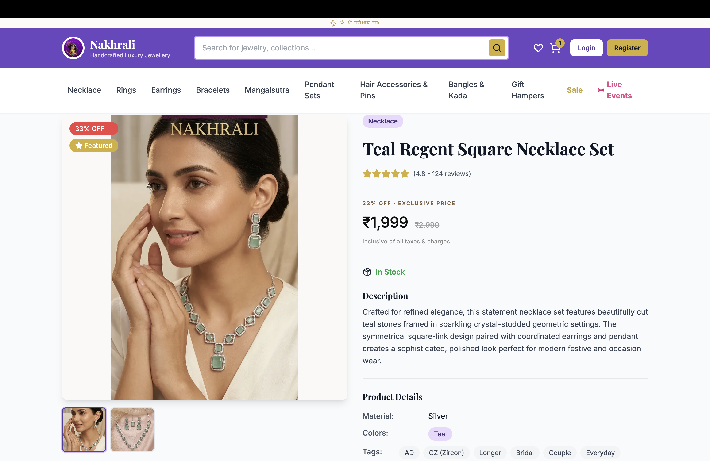
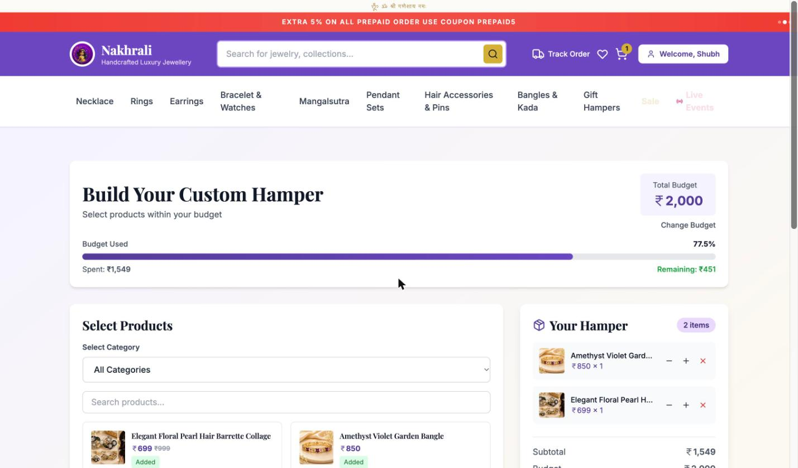
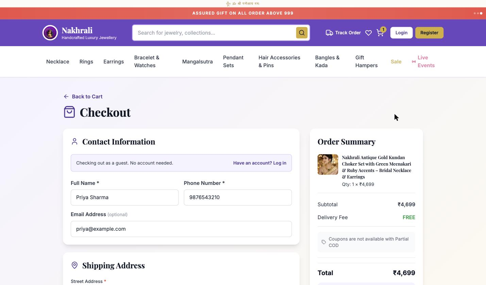
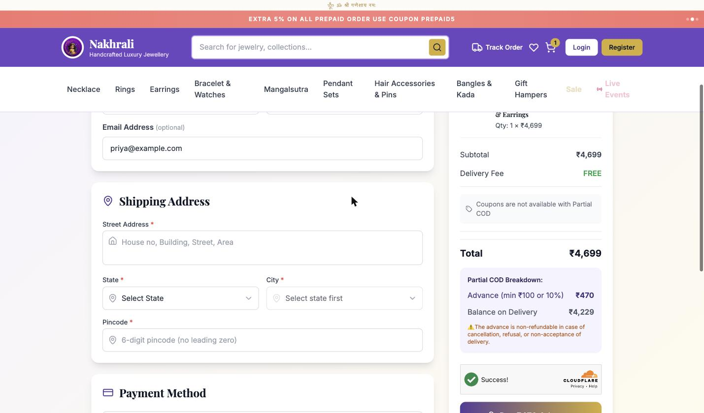
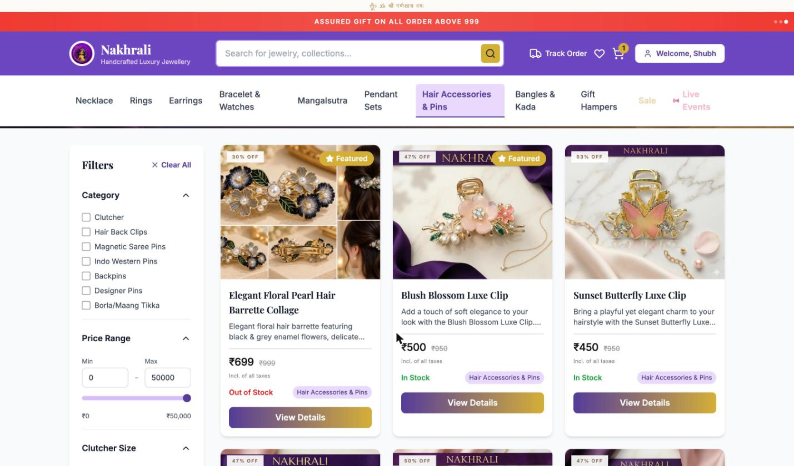
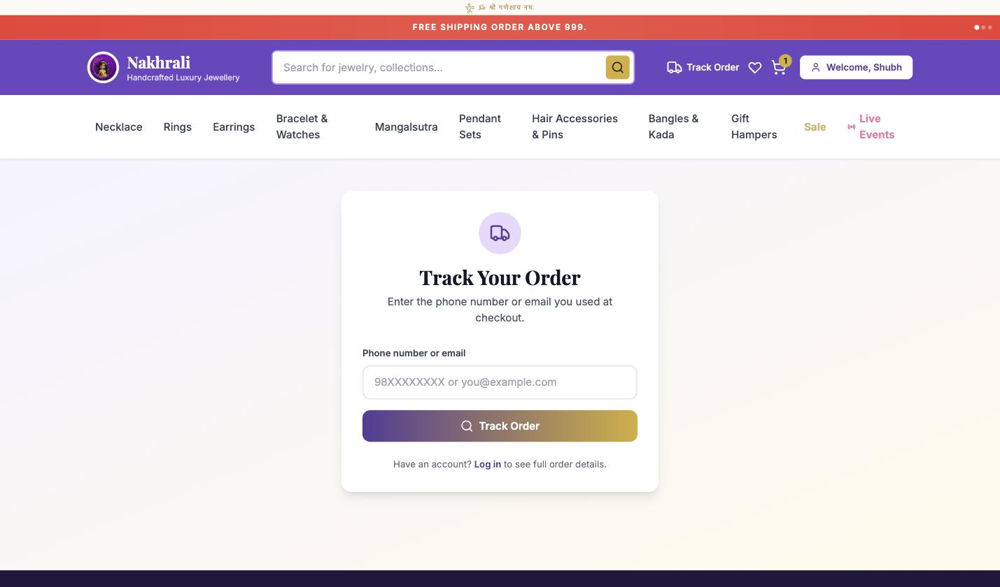
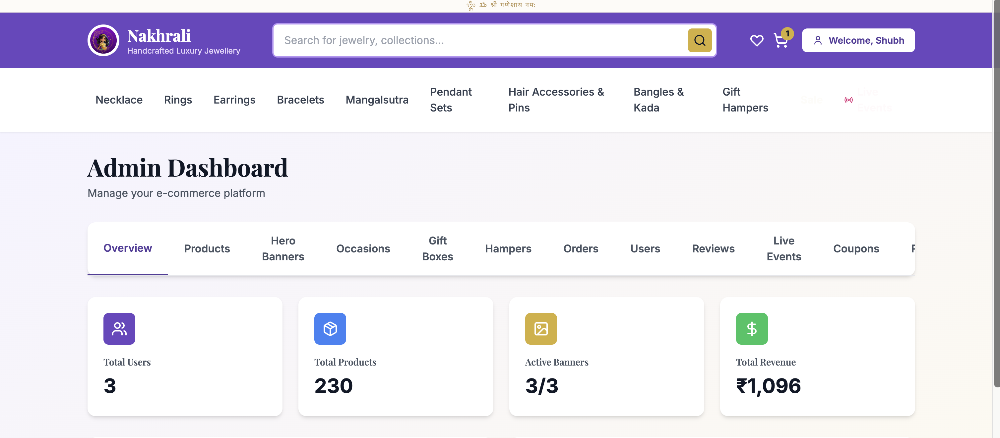
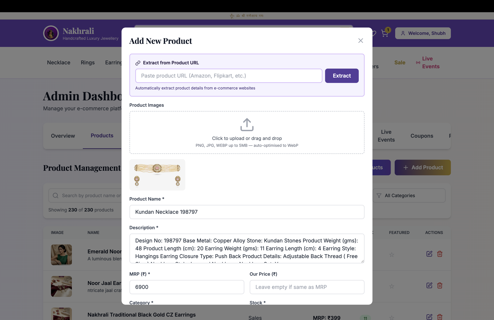
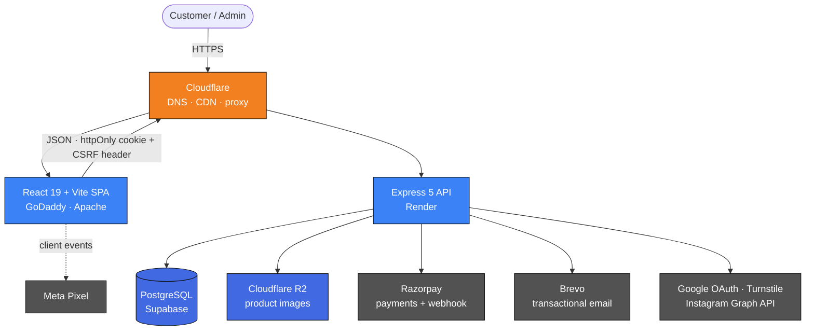

<div align="center">


# Nakhrali Luxury

### A production e-commerce platform powering a Pune-born D2C fashion jewellery brand.

**Designed, built, deployed, and maintained solo. Live in production, taking real orders and payments from customers across India.**

<br />

<a href="https://nakhraliluxury.com">
  
</a>
&nbsp;
<a href="mailto:ghiyashubh23@gmail.com?subject=Nakhrali%20code%20walkthrough">
  
</a>

<br /><br />


</div>

---

<div align="center">


<sub><i>The live storefront at nakhraliluxury.com</i></sub>

</div>

---

## At a glance

<table align="center">
  <tr>
    <td align="center" width="20%"><b>35,000+</b><br /><sub>lines of code</sub></td>
    <td align="center" width="20%"><b>33</b><br /><sub>frontend routes</sub></td>
    <td align="center" width="20%"><b>17</b><br /><sub>API modules</sub></td>
    <td align="center" width="20%"><b>7</b><br /><sub>server checks before an order is saved</sub></td>
    <td align="center" width="20%"><b>100%</b><br /><sub>client-managed merchandising</sub></td>
  </tr>
</table>

---

## Table of contents

- [About this repository](#about-this-repository)
- [What it is](#what-it-is)
- [Features](#features)
- [What's new](#whats-new-october-2026)
- [Screenshots](#screenshots)
- [Architecture](#architecture)
- [Tech decisions](#tech-decisions)
- [Tech stack](#tech-stack)
- [Engineering deep dives](#engineering-deep-dives)
- [Engineering practices](#engineering-practices)
- [About me](#about-me)

---

## About this repository

This repository is a **public case study, not the source code.** The application is a paid client engagement and lives in a private repository.

> Hiring teams and recruiters can request read access to the private repo by email. I'm happy to walk through the codebase on a call.

---

## What it is

A full-stack e-commerce platform for [Nakhrali](https://nakhraliluxury.com): storefront, gift-hamper builder, guest checkout, live payments, order tracking, transactional email, and a 14-module admin dashboard. It is not a demo store. It handles real orders and real money, and a non-technical owner runs it day to day without the engineer in the loop.

|  |  |
| :--- | :--- |
| **Stack** | React 19 · Vite 7 · Tailwind · Express 5 · PostgreSQL (raw SQL) · Razorpay |
| **Hosting** | GoDaddy (frontend) · Render (API) · Supabase (Postgres) · Cloudflare (DNS, CDN, R2 image storage) |
| **Integrations** | Razorpay · Google OAuth · Cloudflare Turnstile · Brevo email API · Instagram Graph API · Meta Pixel |
| **Scale** | ~35k LOC · 33 frontend routes · 17 API modules · 27 SQL migrations · 15 admin components |
| **Status** | Live, actively maintained, on retainer for new features |

---

## Features

### For shoppers

| Feature | What it does |
| :--- | :--- |
| **Catalog and search** | Category pages with shareable URL filters (sub-category, colour, plating, size, price), plus Postgres full-text search |
| **Colour variants** | Each colour has its own images, SKU, and stock count |
| **Volume pricing** | "Buy more, save more" tiers with optional expiry dates |
| **Gift hampers** | Ready-made hampers by occasion, plus a budget-aware custom hamper builder |
| **Guest checkout** | Buy with just a name and phone number. No account needed |
| **Payments** | Razorpay (UPI, cards, netbanking, wallets) and Partial COD (10% advance online, minimum ₹100) |
| **Coupons and promotions** | Flat or percentage coupons, plus rule-based free-delivery promotions by category or tag |
| **Order tracking** | Public lookup by phone or email, showing a safe, limited view of the order |
| **Accounts** | Email/password or Google sign-in, password reset by email, saved addresses, order history, reviews |
| **Emails** | Order confirmation for customers and new-order alerts for the store owner |

### For the store owner (admin dashboard)

Products (with bulk upload and a one-click product importer), orders (including settling Partial COD balances), users, reviews, coupons, promotions, banners, announcement bar, hampers, gift boxes, occasions, live events, and category-wise sales reports.

---

## What's new (October 2026)

The platform keeps shipping after launch. Recent work:

- **Guest checkout:** customers can pay without creating an account. A short-lived, payment-only token is issued after a bot check, and a guest can later turn the order into a full account from a "Set your password" link in the confirmation email.
- **Public order tracking:** look up orders by phone or email, with a strict rate limit and a deliberately limited response (no address, phone, or prices).
- **Order success page and confirmation emails**, sent through the Brevo HTTPS API from the brand's own authenticated domain.
- **Password reset** with hashed, single-use, one-hour tokens.
- **Promotions engine:** owner-managed free-delivery rules (for example, free delivery on all Borla / Maang Tikka orders), checked by the server at payment time.
- **Volume pricing tiers** and **colour-level stock**, both enforced on the server.
- **Shareable filter URLs** on category pages.
- **Instagram feed** on the homepage, served through a server proxy so the access token never reaches the browser.

---

## Screenshots

> Captured from production at [nakhraliluxury.com](https://nakhraliluxury.com).

<table>
  <tr>
    <td width="50%" align="center">
      
      <br /><sub><b>Product detail</b>: image gallery, colour variants, live stock</sub>
    </td>
    <td width="50%" align="center">
      
      <br /><sub><b>Hamper builder</b>: set a budget, add products, live budget tracking</sub>
    </td>
  </tr>
  <tr>
    <td width="50%" align="center">
      
      <br /><sub><b>Guest checkout</b>: name and phone only, no account needed</sub>
    </td>
    <td width="50%" align="center">
      
      <br /><sub><b>Partial COD</b>: server-computed advance and balance, Turnstile bot check</sub>
    </td>
  </tr>
  <tr>
    <td width="50%" align="center">
      
      <br /><sub><b>Category page</b>: sub-category, price, and size filters kept in the URL</sub>
    </td>
    <td width="50%" align="center">
      
      <br /><sub><b>Order tracking</b>: look up by phone or email, no login</sub>
    </td>
  </tr>
  <tr>
    <td width="50%" align="center">
      
      <br /><sub><b>Admin dashboard</b>: revenue, users, orders, top products</sub>
    </td>
    <td width="50%" align="center">
      
      <br /><sub><b>One-click importer</b>: paste an Amazon or Flipkart URL, the backend extracts title, description, price, and gallery</sub>
    </td>
  </tr>
</table>

---

## Architecture


```mermaid
flowchart TB
    user([Customer / Admin])
    cf[Cloudflare<br/>DNS · CDN · proxy]
    fe[React 19 + Vite SPA<br/>GoDaddy · Apache]
    be[Express 5 API<br/>Render]
    db[(PostgreSQL<br/>Supabase)]
    r2[Cloudflare R2<br/>product images]
    rzp[Razorpay<br/>payments + webhook]
    mail[Brevo<br/>transactional email]
    ext[Google OAuth · Turnstile<br/>Instagram Graph API]
    meta[Meta Pixel]

    user -->|HTTPS| cf
    cf --> fe
    fe -->|JSON · httpOnly cookie + CSRF header| cf
    cf --> be
    be --> db
    be --> r2
    be --> rzp
    be --> mail
    be --> ext
    fe -.->|client events| meta

    classDef edge fill:#f38020,stroke:#0a0a0a,color:#fff;
    classDef app fill:#3b82f6,stroke:#0a0a0a,color:#fff;
    classDef data fill:#4169e1,stroke:#0a0a0a,color:#fff;
    classDef extc fill:#525252,stroke:#0a0a0a,color:#fff;
    class cf edge;
    class fe,be app;
    class db,r2 data;
    class rzp,mail,ext,meta extc;
```

- The frontend is a static React build served by Apache on GoDaddy, behind Cloudflare. Apache handles the HTTPS redirect, SPA fallback, security headers, and caching.
- The Express API on Render is the only service that talks to the database, image storage, payment gateway, and email provider. All secrets live in server environment variables and never reach the browser.
- Images are resized and converted to WebP on upload, then stored in Cloudflare R2.

---

## Tech decisions

The interesting part of any project is what was rejected, not just what was chosen.

**Separate SPA + API over Next.js.** The brand needed a static frontend that could sit on its existing GoDaddy hosting, and an API that could be scaled or moved on its own. A single SSR framework would have tied the two together. Losing built-in SSR was acceptable because the SEO surface is small.

**Raw SQL over an ORM.** The queries are Postgres-specific (JSONB variants and tags, full-text search, row locks during checkout). Hand-written, parameterised SQL through `pg` keeps the data layer transparent and avoids fighting a query builder.

**The server is the only source of truth for money.** The browser sends only product IDs, quantities, and chosen colour or size. Prices, tiers, coupons, promotions, and shipping are all recalculated from the database at payment time. A tampered cart can't change what the customer is charged.

**Cookies + CSRF + token versioning over plain bearer tokens.** Sessions use an httpOnly cookie, so JavaScript on the page can't read the token. A double-submit CSRF header protects state-changing requests. Each JWT carries a version number from the database: logging in again or resetting a password bumps it, which ends older sessions without needing a session store.

**Guest tokens scoped to payment only.** Guest checkout issues a short-lived token that the payment and coupon endpoints accept but every account endpoint rejects. A guest can place an order, but can never read anyone's profile, addresses, or order history.

**Postgres full-text search over Elasticsearch.** A trigger-maintained `tsvector` column with `ts_rank` ranking is enough for this catalog size, with a `LIKE` fallback. No extra service, no extra bill.

**Brevo HTTPS API over SMTP.** The Render plan blocks outbound SMTP ports, so email goes through Brevo's HTTPS API from the brand's own authenticated domain. SMTP stays as a local-development fallback.

**Cloudflare R2 for images.** S3-compatible storage with no egress fees, which matters for an image-heavy jewellery catalog.

**Boring frontend hosting on purpose.** The client already had the domain and hosting on GoDaddy, and a static build is just files. The build artifact stays portable, and a one-command deploy script packages it safely.

---

## Tech stack

<table>
  <tr>
    <td valign="top" width="33%">
      <h3>Frontend</h3>
      <br />
      <br />
      <br />
      <br />
      
    </td>
    <td valign="top" width="33%">
      <h3>Backend</h3>
      <br />
      <br />
      <br />
      <br />
      <br />
      
    </td>
    <td valign="top" width="33%">
      <h3>Data &amp; infra</h3>
      <br />
      <br />
      <br />
      <br />
      
    </td>
  </tr>
</table>

---

## Engineering deep dives

<details>
<summary><b>Payment integrity: the browser never decides the price</b></summary>

<br />

Naive integrations trust the cart total sent by the browser and confirm orders on the client. Here, an order only exists after the server has checked everything itself.

**1. Create the payment (server).** The server rebuilds the cart from the database: base or sale price, the best active volume tier, colour availability, coupon, free-delivery promotions, and shipping. It checks stock per product and per colour, then creates the Razorpay order with the full price breakdown stored in the order notes.

**2. Pay (browser).** Razorpay Checkout opens and returns `order_id`, `payment_id`, and `signature`.

**3. Verify (server).** In one database transaction, the server runs seven checks before saving anything:

| # | Check | Stops |
| :--- | :--- | :--- |
| 1 | Idempotency on payment and order IDs | Duplicate orders from retries or double clicks |
| 2 | HMAC-SHA256 signature check | Forged "payment succeeded" calls |
| 3 | Order belongs to the caller | Reusing someone else's payment |
| 4 | Recompute the cart, reject drift above ₹1 | Cart or price tampering between steps |
| 5 | Match the amount Razorpay actually captured | Amount manipulation |
| 6 | Lock stock rows (`SELECT ... FOR UPDATE`) and re-check | Overselling when two people buy the last item |
| 7 | Re-validate the coupon | Expired or used-up coupons |

Only then does it insert the order, reduce product and colour stock, count the coupon use, and commit. Emails go out after the commit and never block the response.

**Webhook as a safety net.** Razorpay's webhook is HMAC-verified but never creates orders. If money was captured with no matching order, it alerts the store owner instead of guessing.

**Partial COD.** The customer pays 10% (minimum ₹100) online and the rest on delivery. The admin marks the balance as collected from the dashboard.

</details>

<details>
<summary><b>Guest checkout without opening a security hole</b></summary>

<br />

Forcing sign-up before payment loses sales, but "anyone can check out with any email" can leak data if done carelessly.

- The guest form is protected by Cloudflare Turnstile and a rate limit.
- The server finds or creates a passwordless account and returns a **2-hour token scoped to checkout only**. Account endpoints reject it.
- The response is identical for new and existing accounts, so it can't be used to find out who is a customer.
- Email is optional. Phone-only guests get an internal placeholder address that the mailer refuses to send to.
- After an order, a real-email guest gets a single-use "Set your password" link to turn the purchase into a full account.

</details>

<details>
<summary><b>One-click product importer, with SSRF protection</b></summary>

<br />

**The problem.** Every new product meant typing the title, copying the description, formatting the price, and downloading four to six images by hand, roughly ten minutes each.

**The solution.** The admin pastes an Amazon or Flipkart URL. The server fetches the page, `cheerio` parses it, and site-specific selectors pull the title, description, price, and full image gallery into the product form for review. Adding a product now takes seconds.

**The risk.** "Fetch any URL the user gives you" is a classic Server-Side Request Forgery (SSRF) hole. The endpoint is admin-only, allows only `http`/`https`, blocks localhost and private or link-local IP ranges, caps redirects at three, and times out after 10 seconds.

```js
const response = await axios.get(url, {
  headers: { 'User-Agent': '...' },
  timeout: 10000,
  maxRedirects: 3, // limits redirect-based SSRF
});
const $ = cheerio.load(response.data);

if (url.includes('amazon.')) {
  productData.name = $('#productTitle').text().trim();
  // ... description bullets, price reassembly, image gallery
}
```

</details>

<details>
<summary><b>Search: ranked full-text search on plain Postgres</b></summary>

<br />

- A `search_vector` (`tsvector`) column is kept up to date by a database trigger.
- Queries use `to_tsquery` with `ts_rank` ranking, plus a name `LIKE` match so partial words still hit.
- If the column is missing (for example, on a database where the migration hasn't run yet), the code falls back to a ranked multi-field `LIKE` search instead of failing.
- Tag-based suggestions come back in the same request.

</details>

<details>
<summary><b>Security hardening</b></summary>

<br />

| Area | Implementation |
| :--- | :--- |
| Sessions | httpOnly, Secure cookies · double-submit CSRF token on state-changing requests · JWT token versioning to end old sessions |
| Passwords | bcrypt (12 rounds) · reset tokens stored only as SHA-256 hashes, single use, one-hour expiry |
| Bots and abuse | Cloudflare Turnstile on login, register, guest checkout, and password reset · per-route rate limits (global 300 / 10 min, auth 10 / 15 min, order tracking 10 / 15 min) |
| Input | Parameterised SQL everywhere · HTML stripped from every request body · `hpp` · shared validators for Indian phone numbers, pincodes, and addresses |
| Uploads | In-memory upload, file-type check by magic bytes (not the file extension), then re-encoded to WebP with `sharp` |
| Access control | Admin rights are checked on the server for every admin route. The frontend's admin check only controls what is shown |
| Headers | Helmet on the API · HSTS, `X-Frame-Options`, `nosniff`, and `Permissions-Policy` from Apache · Content Security Policy · Subresource Integrity hashes added to the build |
| Data exposure | Order tracking returns a limited view only · admin alert emails for orphaned payments · error messages never leak payment internals |
| Secrets | Server-only environment variables · `.env` files git-ignored · third-party tokens (Instagram, payments, email) never sent to the browser |

</details>

<details>
<summary><b>Performance</b></summary>

<br />

- 30 lazy-loaded routes, with Vite splitting vendor code into `react-vendor`, `swiper`, and `ui-vendor` chunks
- Images compressed in the browser before upload, then resized to 1000 px WebP on the server
- Product images served from Cloudflare R2, with static assets cached at the Cloudflare edge and by Apache cache headers
- Short-lived in-memory API cache (1 to 10 minutes) for catalog reads, cleared on every admin write
- Instagram posts cached for 3 hours, with the last good copy saved in the database as a fallback
- Preconnect hints and non-blocking font loading

</details>

---

## Engineering practices

- **Idempotent SQL migrations** (27 so far), each written to be safe to run more than once. New code checks for new columns first, so a deploy never breaks while a migration is pending.
- **Automated tests** with Node's built-in test runner for the API client, CSRF middleware, and pricing helpers, plus ESLint.
- **Mirrored client and server logic** for pricing tiers, shipping thresholds, and validation, with the server always authoritative.
- **Safe deploys:** one command builds, adds SRI hashes, and packages the frontend while checking that the Apache config file is included. The API auto-deploys from `main` on Render.

---

## About me

I'm **Shubh Ghiya**, a final-year dual-degree student at **IIT Madras** (BS in Data Science) and **UIT RGPV Bhopal**. I built Nakhrali end to end as a paid client engagement: requirements, architecture, frontend, backend, database design, payments, security, deployment, and ongoing maintenance. The store is live, the client runs it independently, and I'm on retainer for new features.

**Open to software engineering internships (2026) and full-time roles (2027)** in full-stack, backend, and AI/ML engineering.

<p>
  <a href="mailto:ghiyashubh23@gmail.com">
    
  </a>
  &nbsp;
  <a href="https://drive.google.com/file/d/1Mk4IvyDjdUaPmGgZ1ONd1-FvB7c8jkKy/view?usp=sharing">
    
  </a>
  &nbsp;
  <a href="https://www.linkedin.com/in/shubh-ghiya/">
    
  </a>
  &nbsp;
  <a href="https://github.com/morningstar0521">
    
  </a>
</p>

> **Hiring teams:** email me for read access to the private source repo, and I'll walk you through the codebase on a call.

---

<div align="center">
<sub>© Nakhrali. Code proprietary. This README is a public case study published with permission of the brand.</sub>
</div>
